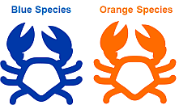

# Get the data
The data set for this guide is available online as a github repository. 

* Go the file at the github address https://raw.githubusercontent.com/tercen/getting_started/master/crabs/data/crabs_longformat.csv

* Click right and select **Save as...**

Save your data on your desktop. Use the default name.

__Crab data description:__

The dataset is called "crabs" and it is in a _long format_. It has a total of 1000 measurements of crab physical traits. It is composed of four groups (two sexes and two species) of 50 measurements for five traits variables, ``FL`` (frontal lobe size in mm), ``RW`` (rear width mm), ``CL`` (carapace length mm), ``CW`` (carapace width mm) and ``BD`` (body depth mm). In summary it is:  

Factor|values
------|---
``sp`` |species, ``B`` or ``O`` for Blue or Orange.
``sex``|``M`` or ``F``
``index``|index 1 to 50 within each of the four groups, 2 sex and 2 species
``variable``|one of five variables: ``FL``, ``RW``, ``CL``, ``CW`` and ``BD``
``measurement``| the value of one of the five ``variable``

