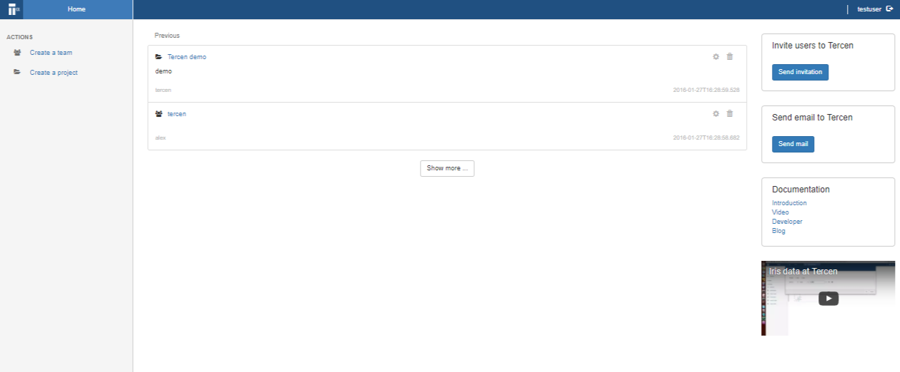

# Create a project

* On the home page (once logged in) click on the **Create a project**

* Enter "my playground" in the **Name** and click **OK**

* You see an entry entitled "my playground" on the top bar.
You have created a project

* When in the project, notice the new entries on the left:
    + **Create a data set**
    + **Create workflow**
    + **Create operator**

The guide fill cover these in later chapters.