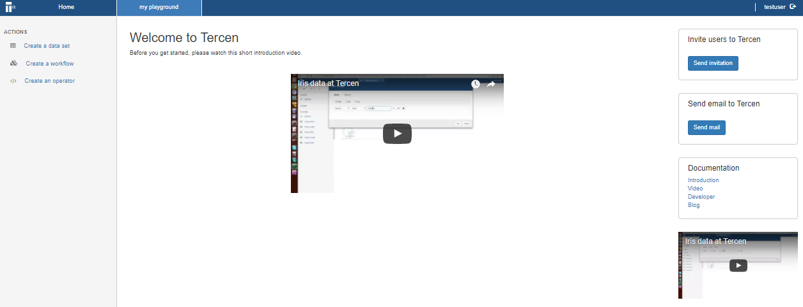
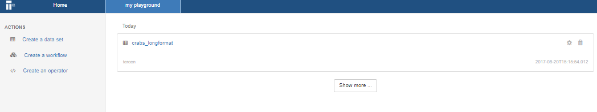

# Upload the data
In this section you upload an example data set.

_TercenCloud_ accepts data in either _.tsv_ or _csv_. These data set ``crabs_longformat.csv`` is in a _.csv_ and is in a _long format_.

*Go to the _project page_ by clicking on the ``public`` project

You may already have a personal project area, in which case go this project.

  
* Click on **Create a data set**

A dialog window opens which allows you to select the data file.

  
* Click on the **Choose File** button and select your file (i.e ``crabs_longformat.csv``).

Please make sure to select the separator, the encoding and the quote format.

Selecting the separator requires you to select one of three options:

* Comma (default)
* Semicolon
* Tab

Please select **Comma** for this dataset.

Selecting the encoding requires you to select one of two options:

* Latin 1 (default)
* UTF 8

Leave the default.

Selecting the quote requires you to select one of three options:

* Double (Default)
* Simple
* None

Leave the default..

* Click **Next**

You see what column headers were detected and their associated type.

* Click **OK**
You will now see the new data set in the _project page_.

