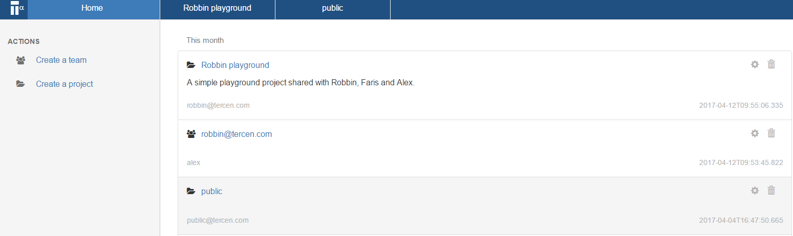

# Create a workflow
In this section you create a workflow.

* Go to the _project page_

  
* Click on **Create a workflow**

A dialog window opens which allows you to select the data file.

* Please fill in the **Name** with the name ``crab workflow`` 
The following information is possible:
* Name (Mandatory)
* Description (Optional)
* Wiki Link (Optional)

* Click **Next** and then click **OK**
You will now have an empty _workflow page_ titled ``Crab workflow`` you gave it.

* Right click in the _workflow page_  and select **Add step**

* Select **Table** and click **OK**
A new step named Table should appear on your _worklow page_.

* Right click on the Table step and select **Run**
A window appear allowing you to select the data sets which are available.
Select the crab data set you have uploaded.

* Select data set and click **OK**
The Table step should now be green.

You have now successfully imported you data sets into the workflow.