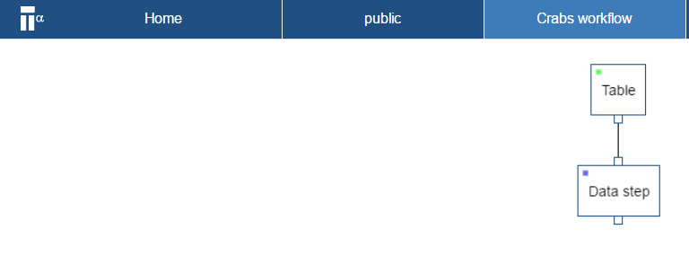
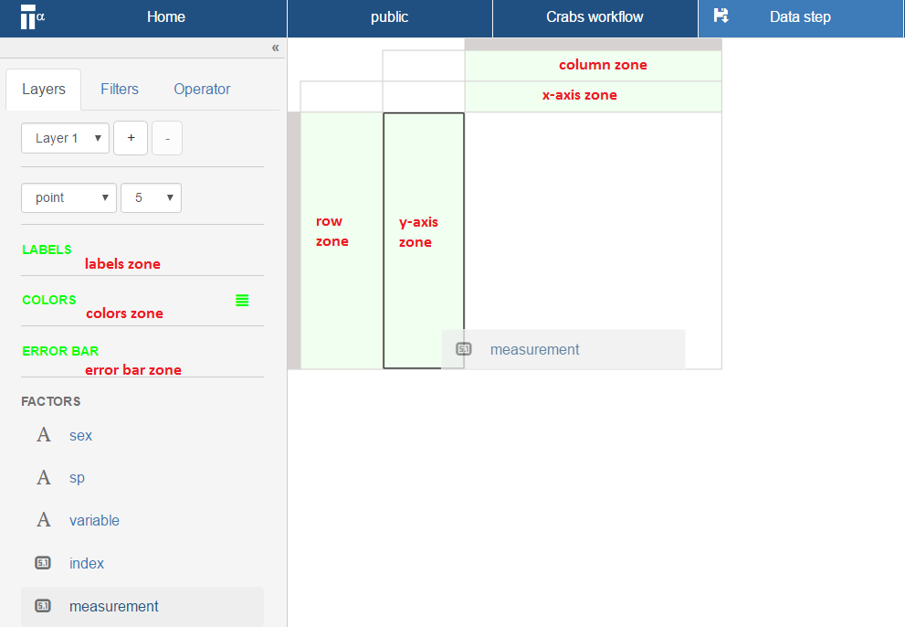

# Define a view
In this section you create a visual.
Once you have imported your data into the workflow now you can configure a __projection__.

* Right click on the Table step and select **Add step**

* Select **Data step** and click **OK**.

Your workflow should look like:

* Double click on the data step
A _projection page_ opens

  
The _projection page_ is composed of different zones. The main zones are highlighted in green below:

You can create any projection by dragging-n-dropping of items in the _factors_ list to the different _zones_ (indicated by the color green) of the _projection page_. There are four _zones_ on the right and three on the left.

On the right are:

* _y-axis zone_
* _x-axis zone_
* _column zone_
* _row zone_

on the left are:

* _label zone_
* _colors zone_
* _error bar zone_

* Drag-n-drop the ``measurement`` factor to the y-axis zone

* Drag-n-drop the ``variable`` factor to the row zone

* Drag-n-drop the ``index`` and  ``sp`` and ``sex`` factor to the column zone

The image should look like the one above. Notice, the variable are the row and the observations are the columns.

* Drag-n-drop the ``measurement`` to colors zone

* Select ``heatmap`` in the drop down menu where it currently says ``point`` 

The projection window should now show the following:

