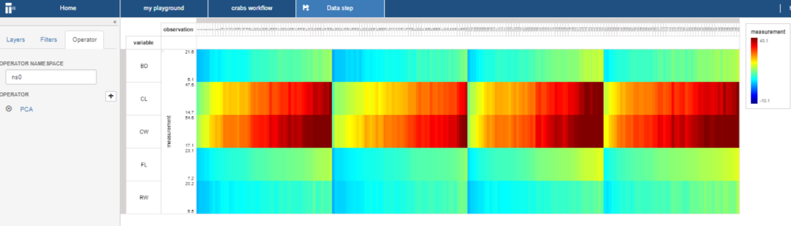
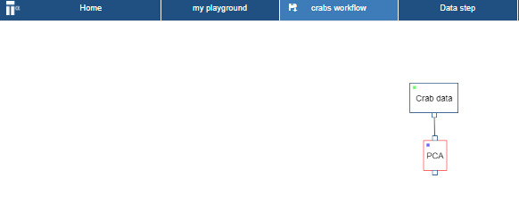

# Compute
In this section you perform a computation.
The projection you created in the previous section can also be used by a computation (i.e. _operator_).
This is due to the _What you see is what you compute_ paradigm. The following steps outlines how to add an _operator_.

* Click on the **Operator** tab

* Go to the **Public tab** and select  the ``PCA`` operator, click **OK**

* Click on the save icon of the Data step page bar
The save icon (see red circle in figure below) will disappear once it is saved 

* Go to the workflow page

* Right click on the data step and select **Rename**

Rename it to "PCA" 

* Right click on the data step and select **Run**
The the data step status color will now go from blue to red (i.e in progress). Wait until the status goes to green (i.e completed).

