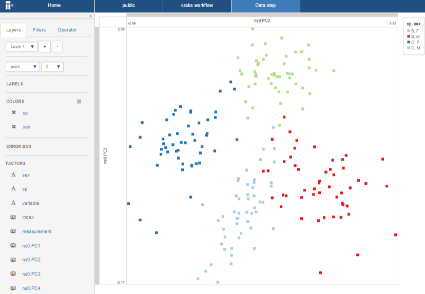

# Visualize the result
In this section you visualize the output of your previous PCA computation. The visual uses two principal components in a pair-wise plot.

* Right click on the data step and select **Add step** 

* Choose a **Data step** and click **OK**

* Open the newly created data step
A new projection page opens. This projection page should be familiar as you have seen this before in the previous steps of the this guide. However you will notice there are additional factors in the factor list, namely PC1, PC2, etc..

* Drag-n-drop the ``PC2`` factor to the _x-axis zone_
* Drag-n-drop the ``PC3`` factor to the _y-axis zone_
* Drag-n-drop the ``sex`` and ``species`` factor to the _colors zone_

