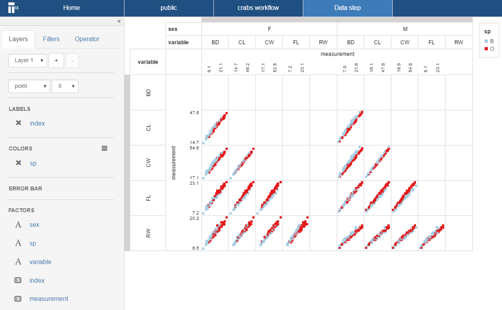
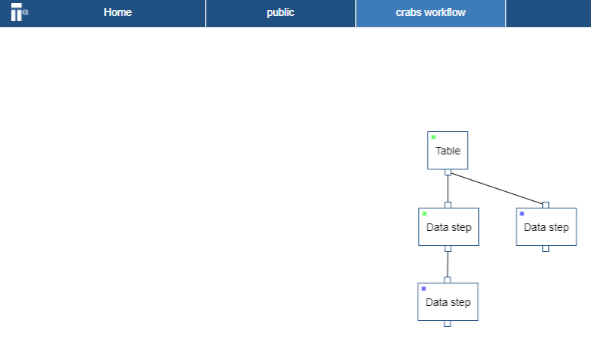

# Visualize a pairwise
In this section you create a multi-group pairwise visual.

* Click on the first data step and select **Add step** 

* Choose a **Data step** and click **OK**
This will create a second data step (see workflow screen shot below)

* Open the newly created data step
A new projection page opens. We will now create a pairwise projection of the ``variable``.

* Drag-n-drop the ``measurement`` factor to the _y-axis zone_
* Drag-n-drop the ``variable`` factor to the _column zone_
* Drag-n-drop the ``variable`` factor to the _row zone_
* Drag-n-drop the ``index`` factor to the _label zone_

This is a pairwise projection and it is a direct result of putting the same factor (i.e. ``variable``) on the row and column zone. However this projection can be further developed into multi-group pariwise.

* Drag-n-drop the ``sp`` factor to the _column zone_
* Drag-n-drop the ``sex`` factor to the _color zone_

You have now completed the multi-group pairwise. This view is a powerful projection.

Your workflow should look like the following:

