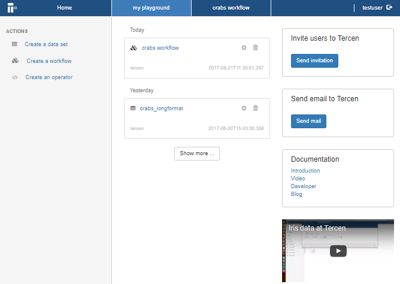
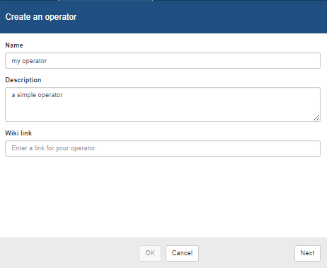
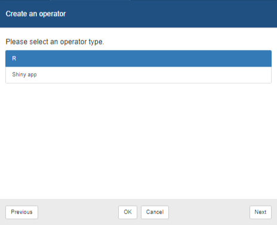
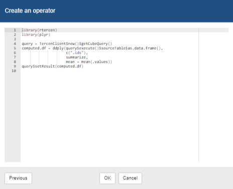
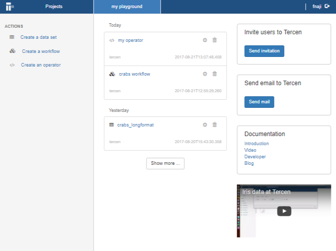

# Create an operator

In the project page you can create an operator.

* Click on **Create an operator**

* Fill in the name and click **Next**

* Select **R** and click **Next**

* Click **OK**
The default code is a mean operator.

The operator appears in your project area.

