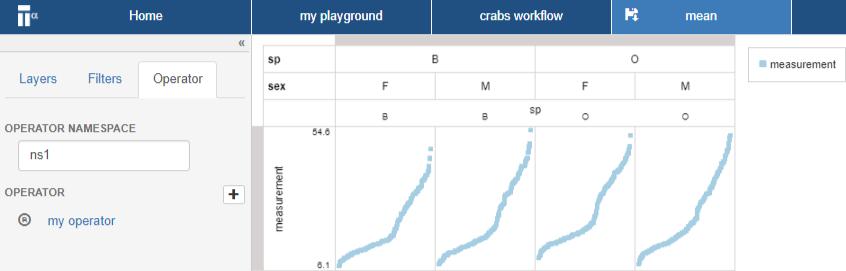
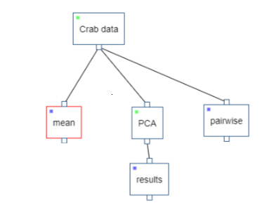
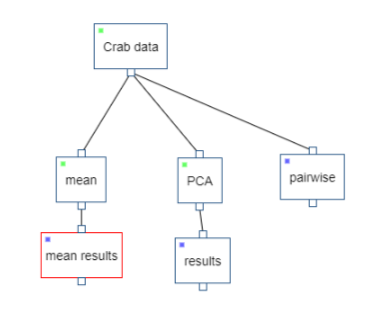
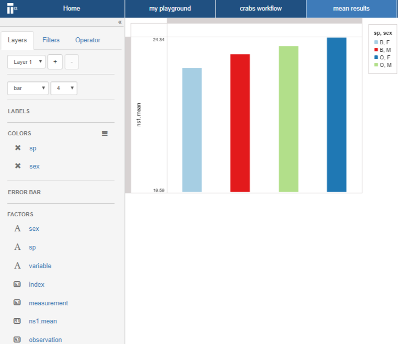

# Run operator
In this section you run the operator you created in the previous section.

* Open the ``crab workflow`` 

* Right click on the data step ``Crab data``

* Select **Add step** and select **Data step**

* Right click on the new data step and select **Rename** and rename it to "mean"

* Double click on the new "mean" step

* Drag-n-drop the factor ``measurement`` to the y-axis zone

* Drag-n-drop the factor ``sp`` and ``sex`` to the column zone 

* Click on **Operator** tab 

* Click on the ``+`` button

* Add the ``my operator`` operator

* Save the ``mean`` data step 

* Go to ``crab workflow`` page

* Right click on the ``mean`` data step and select **Run**

The ``mean`` data step should go from blue to green.

* Right click on the data step named "mean" and **Add step** and select **Data step**

* Right click on the new data  step and select **Rename**, rename to "mean results"

* Open the new ``mean results`` data step

* Drag-n-drop ``ns1.mean`` to the y-axis zone

* Drag-n-drop ``sp`` and ``sex`` to the color zone

* Select ``bar`` in the drop down menu where it currently is ``point``

You have now completed the creation of your own operator. This operator was run on Tercen. In the next Chapter you will run the same operator locally.