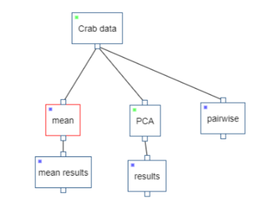
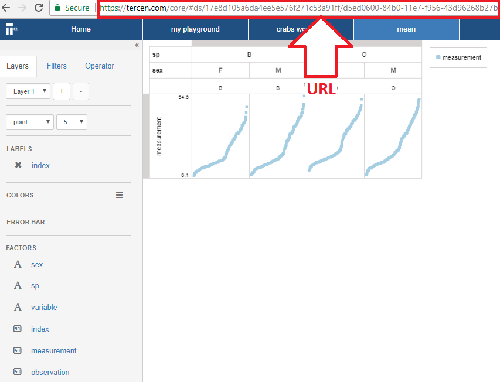

# Run operator locally
In this section you run an operator you created in a previous chapter, but now locally (i.e. on your own computer not on Tercen). To run an operator locally you require to have the ability to run R scripts (e.g. using RGui or RStudio).

Again the R ``mean`` operator is used as an example. 

* Go to the ``crabs workflow``
* Right click on the "mean" data step and select **Reset**

The step should go eventually <span style="color:blue">__blue__</span>.



* Go to the ``mean`` data step (if its not open already then double click on the ``mean`` data step)



* Copy the URL and identify the workflowId and stepId.

The URL structure is https://tercen.com/core/index.html#ds/{workflowId}/{stepId}

where workflowId and stepId is a hexadecimal number(with hyphens).

An illustrative example (see figure above) is given:
``https://tercen.com/core/#ds/17e8d105a6da4ee5e576f271c53a91ff/d5ed0600-84b0-11e7-f956-43d96268b27b``

In the above URL, workflowId = ``17e8d105a6da4ee5e576f271c53a91ff`` and stepId = ``d5ed0600-84b0-11e7-f956-43d96268b27b``.

Your URL will be different and therefore so will the workflowId and stepId. Please identify these two identifiers in your actual URL.

* Install rtercen package

```
devtools::install_github("tercen/rtercen", ref = "2.10")
```

* Load the appropriate libraries
```
library(rtercen)
library(plyr)
```

* Replace the long string of Xs (length 32) and the long string of Ys (length 36) indicated below with the actual workflowId and stepId values you identified previously.

```
workflowId = "XXXXXXXXXXXXXXXXXXXXXXXXXXXXXXXX"
stepId = "YYYYYYYYYYYYYYYYYYYYYYYYYYYYYYYYYYYY"
```
* Create a Tercen client object using your actual username and password and replace ``UUUUUU`` and ``PPPPPP`` using them.

```
client = TercenClient$new("UUUUUU"", "PPPPPP")
```

* Get the cube query defined by your workflow
```
query = client$getCubeQuery(workflowId, stepId)
# inspect query as json
# query$toJson()
```
* Execute the query and get the data
```
cube = query$execute()
```
* Get the data as a data frame
```
df <- cube$sourceTable$as.data.frame()
```
* Execute some computation
```
computed.df <- ddply(df, c(".ids"), summarize, mean = mean(.values))
```
In this instance it is a mean operator.

* Send the result to Tercen
```
query$setResult(computed.df)
```
* Go to the ``crabs workflow`` and refresh the page

The ``mean`` data step should now be green. Even though the execution has taken place locally on your computer.


* Open the ``mean results`` data step and check the results. It should be the same results view as when the operator was run on before on the Tercen server.


More documentation can be found at https://github.com/tercen/rtercen